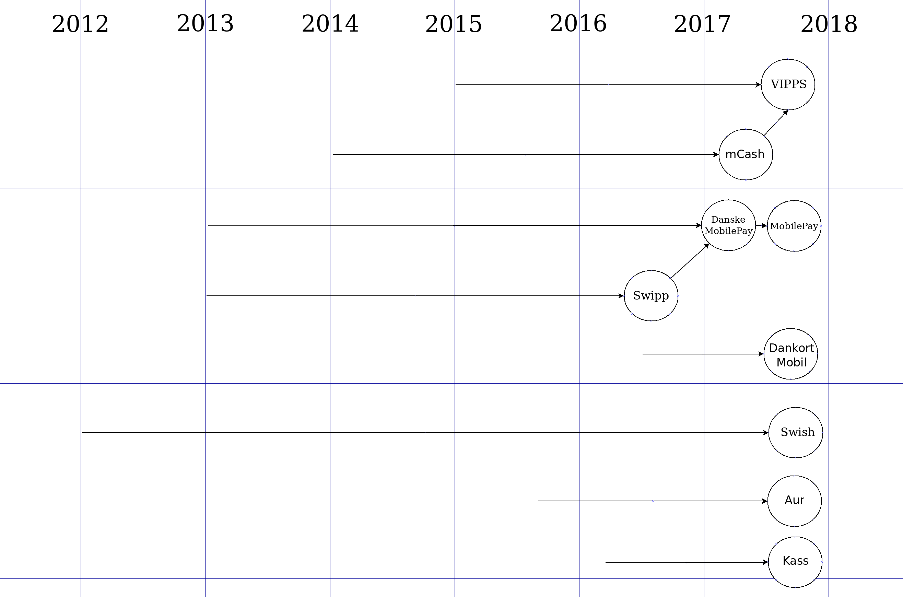

# Player positions in the Nordic mobile phone payment market

## About

Business and markets related things will be written here in order to keep them out of the other pages of this book as they seem to creeping everywhere at the time of writing this.

## TOC

<!-- toc -->

## Timeline

[Source .dia](https://github.com/poplatek/payment-methods-book/blob/master/nordic-mobile-timeline.dia)

## Outlook of the Nordic mobile payment market

MobilePay is aiming at being able to interoperate w/the Swedish Swish in order to be able to transfer payments between Swedish Swish users and Mobilepay users. MobilePay is already available in Denmark, Norway and Finland. It already has a significant user base.

Swish has a large market share in Sweden and seems solely geared to the Swedish markets. As it is so strong locally and offers instant payments in that area, MobilePay is now trying to get into collaboration with Swish rather than attempting to take over its market.

Swish seems likely to stay a major player in the Swedish mobile payments market and if it ends up in collaboration with MobilePay its users will be able to transfer money to many Nordic destinations via the MobilePay infrastructure.

MobilePay is still in competition w/Vipps in Norway but it is not inconceivable that MobilePay would end up trying to strike a similar deal w/Vipps that it is now trying to make w/Swish.

This possible arrangement would leave Vipps as the largest player in Norway, Swish as the largest player in Sweden and MobilePay as the largest player in Denmark. If these three parties interoperated in payments, they would have much of the Nordic mobile payments markets in their hands.

It remains to be seen how the Norwegian and Finnish markets will be split amongst the different players. At this point it doesn't look very likely that MobilePay would be able to take over a larger part of the Norwegian market than Vipps.

The Finnish situation should be assessed on its own. MobilePay has a somewhat similar penetration to the Finnish market as it has in Norway. It is up to the Finnish players to decide how they want to deal with MobileyPay.

If they follow the same route as Norwegians and Swedes have it would mean that the Finnish banks form a grand coalition against MobileyPay that would force MobileyPay to strike some kind of a deal w/the Finnish banks.

## MobilePay

MobilePay is very strong in many ways. It is very prevalent in Denmark but as opposed to Swish and Vipps, it is not a one-country solution.

MobilePay can be used w/non-Danske Bank credit/debit cards and 70% of the MobilePay users are using some other bank than Danske. This is an asset to MobilePay even if it comes with the weakness that only Danske Bank users will be able to receive payments instantly.

MobilePay is aiming at being able to interoperate w/the Swedish Swish in order to be able to transfer payments between Swedish Swish users and Mobilepay users.

MobilePay is already available in Denmark, Norway and Finland and therefore has a strong position in the mobile payment market in the Nordics. It has a very significant user base.

## Swish

Swish is the major mobile payment solution in Sweden. The way it depends on the Bank ID and the Swedish bank systems makes it SEK only and in effect, Sweden only and also forces the users to use two apps, BankID and Swish.

Swish has a large market share in Sweden and seems solely geared to the Swedish markets. As it is so strong locally and offers instant payments in that area, MobilePay is now trying to get into collaboration with Swish rather than attempting to take over its market.

It seems likely that Swish will stay in major control of the Swedish mobile payments market and if it ends up in collaboration with MobilePay its users will be able to transfer money to many Nordic destinations via the MobilePay infrastructure.

## Vipps

Vipps seems similarly positioned in the Norwegian mobile payment markets as Swish is in Sweden as 108 banks co-own Vipps. It has a large market share in the country and has its own app that has some unique features like a chat and the ability to pay to non-Vipps customers via their mobile phone number.

The owner of Vipps, DNB made a defensive move in spinning off Vipps and keeping the controlling (52%) ownership of the company while letting 107 other Norwegians banks acquire 48% of Vipps.

Vipps used to be collaborative even before the spin-off like MobilePay and 40% of its user base comes from non-DNB banks.

